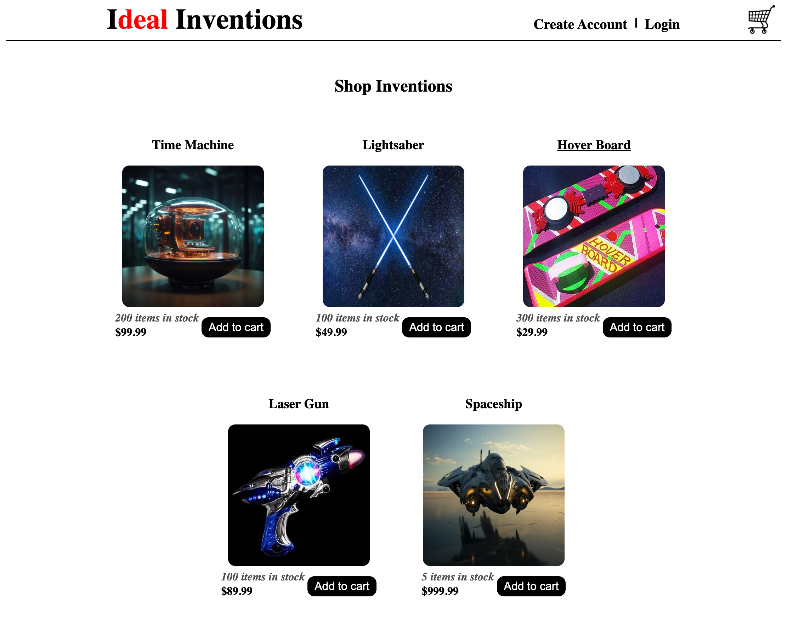

# ideal-inventions

### Table of Contents
- [Description](#Description)
- [Technology](#Technology)
- [Mockup](#Mockup)
- [Installation](#Installation)
- [Usage](#Usage)
- [Deployment Links](#Usage)
- [Contact](#Contact)

## Description
This is an e-commerce app to sale inventions.

## Technology
- mongoDB & mongoose
- react.js
- express.js
- appollo & graphQL
- node
- vscode, github, heroku
- stripe

## Mockup

## Installation
- npm run install

## Usage 
- npm run seed
- npm run develop

## Deployment Links
- [Heroku](https://ideal-inventions-bfdeb806078f.herokuapp.com/)

- [GitHub](https://github.com/mrgreen12375/ideal-inventions)

## Contact
- [Steven Green](https://github.com/mrgreen12375)